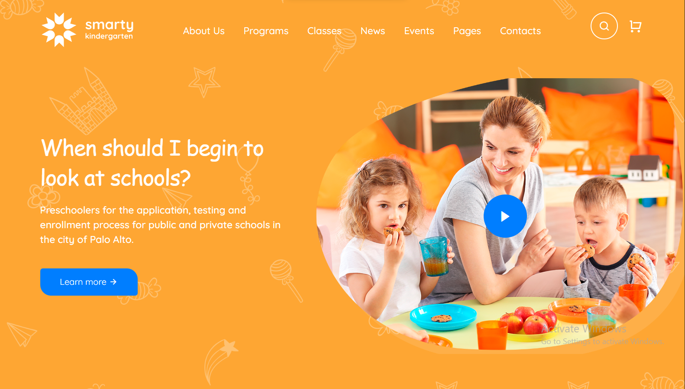

🏫 Kindergarten Website

A modern and fully responsive school website built for a kindergarten institution using HTML, CSS, Bootstrap, JavaScript, jQuery, and Isotope.
The website is designed to provide a clean and engaging experience for parents and visitors while showcasing school information, activities, classes, and more.

🌐 Live Demo

https://kindergartenss.netlify.app/

📸 Preview

✨ Features

Fully responsive design
Modern kindergarten UI layout
Smooth animations and interactions
Multi-page website structure
Gallery filtering using Isotope
Clean and organized sections
Parent-friendly interface
Optimized for desktop, tablet, and mobile devices
Fast and lightweight frontend project

🛠️ Technologies Used

Technology	Purpose
HTML5	Website structure
CSS3	Custom styling
Bootstrap 5	Responsive layout
JavaScript	Interactivity
jQuery	DOM handling & plugins
Isotope.js	Gallery filtering & layouts

🎨 Theme Colors
Color	Hex
Blue	#007EFF
Orange	#FEA633
White	#FFFFFF

📂 Project Structure
Kindergarten/
│
├── css/
├── js/
├── images/
├── assets/
│
├── index.html
├── about.html
├── classes.html
├── gallery.html
├── teachers.html
├── events.html
├── contact.html
├── blog.html
└── README.md

📄 Pages Included
Home Page
About Page
Classes Page
Gallery Page
Teachers Page
Events Page
Blog Page
Contact Page

🚀 Getting Started

Clone Repository
git clone https://github.com/your-username/your-repository-name.git

Run Project

Simply open the index.html file in your browser.
You can also use the VS Code Live Server extension for better development experience.

📱 Responsive Design
The website is fully responsive and works smoothly across:

Desktop Devices
Tablets
Mobile Phones

📦 Dependencies
All libraries and plugins are included via CDN or local files.

Bootstrap 5
jQuery
Isotope.js

🤝 Contributing

Contributions, suggestions, and improvements are welcome.
Feel free to fork the repository and submit a pull request.

👨‍💻 Author

Abdul Rafay
GitHub: Abdul Rafay GitHub Profile

📄 License

This project is open source and available under the MIT License.